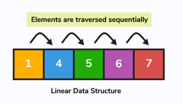

## Linked List

Linked List termasuk dalam `linear data structure`. Lalu apa yang dimaksud dengan `linear data structure ?`

`Linear Data Structure` adalah kumpulan data yang tersusun secara berurutan yang mana pada setiap element datanya terhubung dengan data lainnya yang berdekatan. Pada `linear data structure` kita bisa mengakses setiap element secara berurutan

Berikut beberapa yang termasuk kedalam `linear data structure`

1. Array
2. Linked Lists
3. Queues
4. Stack

`Linked List` adalah salah satu `linear data structure`. Pada `linked list` kita akan mengenal yang namanya `nodes`. `nodes` adalah kumpulan data yang saling terhubung. Pada setiap `node` mengandung data yang disimpan dan alamat memori dari `node` lain yang terhubung dengan `node` tersebut. Setiap `node` disimpan pada alamat memori yang berbeda namun bisa tetap terhubung karena di dalam `node` mengandung alamat memori dari `node` lain

`Linked List` selalu memilik `head`. `head` adalah node awal dari sebuah kumpulan `nodes` yang saling terhubung. Ketika kita mencoba mengakses data pada `linked list`, kita akan memulainya dari `head` secara berurutan sesuai `node` yang terhubung

Beberapa operasi bisa kita lakukan pada `linked list`, antara lain:
1. `Insert`, menambah data pada `linked list`
2. `Delete`, menghapus data berdasarkan key/data pada `linked list`
3. `Display`, menampilkan data `linked list`
5. `Search`, mencari data pada `linked list`

`Linked List` juga mempunya beberapa tipe, antara lain:
1. Singly Linked List
2. Doubly Linked List
3. Circular Linked List
